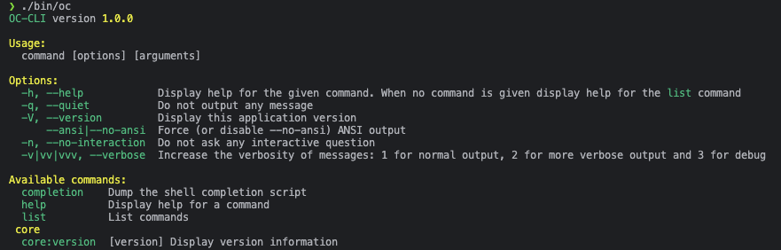

# OC-CLI - OpenCart Command Line Interface

A command-line interface for OpenCart, inspired by WP-CLI. OC-CLI provides a set of command-line tools for managing OpenCart installations without using a web browser.

**Created by [Custom Services Limited](https://support.opencartgreece.gr/) - Your OpenCart experts.**

## Features

- **System Management**: Check installation health, view version information
- **Database Operations**: Backup, restore, and manage database
- **Product Management**: Create, update, list, and delete products and categories
- **Order Management**: View and manage orders
- **Extension Management**: Install, activate, and manage extensions
- **Cache Management**: Clear and rebuild caches
- **User Management**: Manage admin users

## Requirements

- PHP 7.0 or higher
- OpenCart 2.x, 3.x, or 4.x installation
- MySQL/MySQLi support
- Composer (for installation)

## Installation

### Via Composer (Recommended)

```bash
composer global require custom-services-limited/oc-cli
```

### Manual Installation

1. Clone the repository:
```bash
git clone https://github.com/Custom-Services-Limited/oc-cli.git
cd oc-cli
```

2. Install dependencies:
```bash
composer install
```

3. Make the binary executable:
```bash
chmod +x bin/oc
```

4. Add to your PATH (optional):
```bash
echo 'export PATH="$PATH:'$(pwd)'/bin"' >> ~/.bashrc
source ~/.bashrc
```

## Quick Start

Screenshot:


1. Navigate to your OpenCart installation directory:
```bash
cd /path/to/your/opencart
```

2. Check if OC-CLI can detect your installation:
```bash
oc core:version
```

3. List all available commands:
```bash
oc list
```

## Basic Usage

### Check OpenCart Version
```bash
oc core:version
```

### System Information
```bash
oc core:check-requirements
```

### Database Operations
```bash
# Show database info
oc db:info

# Backup database
oc db:backup backup.sql

# Restore database
oc db:restore backup.sql
```

### Product Management
```bash
# List products
oc product:list

# Create a new product
oc product:create --name "New Product" --model "NP001" --price 29.99

# Update a product
oc product:update 1 --name "Updated Product"

# Delete a product
oc product:delete 1
```

### Extension Management
```bash
# List installed extensions
oc extension:list

# Install an extension
oc extension:install extension_name

# Enable an extension
oc extension:enable extension_name
```

## Available Commands

### Core Commands
- `core:version` - Display version information
- `core:check-requirements` - Check system requirements
- `core:config` - Manage OpenCart configuration

### Database Commands
- `db:info` - Display database connection information
- `db:backup` - Create database backup
- `db:restore` - Restore database from backup

### Product Commands
- `product:list` - List products
- `product:create` - Create a new product
- `product:update` - Update an existing product
- `product:delete` - Delete a product
- `category:list` - List categories
- `category:create` - Create a new category

### Order Commands
- `order:list` - List orders
- `order:view` - View order details
- `order:update-status` - Update order status

### Extension Commands
- `extension:list` - List installed extensions
- `extension:install` - Install an extension
- `extension:uninstall` - Uninstall an extension
- `extension:enable` - Enable an extension
- `extension:disable` - Disable an extension

### Cache Commands
- `cache:clear` - Clear all caches
- `cache:rebuild` - Rebuild caches

### User Commands
- `user:list` - List admin users
- `user:create` - Create a new admin user
- `user:delete` - Delete an admin user

## Configuration

OC-CLI can be configured using a `.oc-cli.yml` file in your OpenCart root directory:

```yaml
# .oc-cli.yml
database:
  backup_path: ./backups
  
output:
  format: table  # table, json, yaml
  
cache:
  enabled: true
```

## Output Formats

Most commands support multiple output formats:

```bash
# Table format (default)
oc product:list

# JSON format
oc product:list --format=json

# YAML format
oc product:list --format=yaml
```

## Development

### Running Tests
```bash
composer test
```

### Code Style
```bash
composer cs-check
composer cs-fix
```

### Contributing

1. Fork the repository
2. Create a feature branch
3. Make your changes
4. Add tests for new functionality
5. Ensure all tests pass
6. Submit a pull request

## Extending OC-CLI

You can create custom commands by extending the base Command class:

```php
<?php

namespace OpenCart\CLI\Commands\Custom;

use OpenCart\CLI\Command;

class MyCustomCommand extends Command
{
    protected function configure()
    {
        $this
            ->setName('custom:my-command')
            ->setDescription('My custom command description');
    }

    protected function handle()
    {
        $this->io->success('Hello from my custom command!');
        return 0;
    }
}
```

## License

OC-CLI is open source software licensed under the [GPL v3 license](LICENSE).

## Support

- [GitHub Issues](https://github.com/Custom-Services-Limited/oc-cli/issues) - Bug reports and feature requests
- [Custom Services Limited](https://support.opencartgreece.gr/) - Professional OpenCart support
- [OpenCart Community Forum](https://forum.opencart.com/) - General support

## About Custom Services Limited

Custom Services Limited is a professional OpenCart development and support company. We provide:

- OpenCart development and customization
- Extension development
- Performance optimization
- Technical support and consulting
- Training and documentation

Visit us at [https://support.opencartgreece.gr/](https://support.opencartgreece.gr/) for more information about our services.

## Changelog

### 1.0.0
- Initial release
- Core version command
- Basic project structure
- PHP 7.0+ compatibility